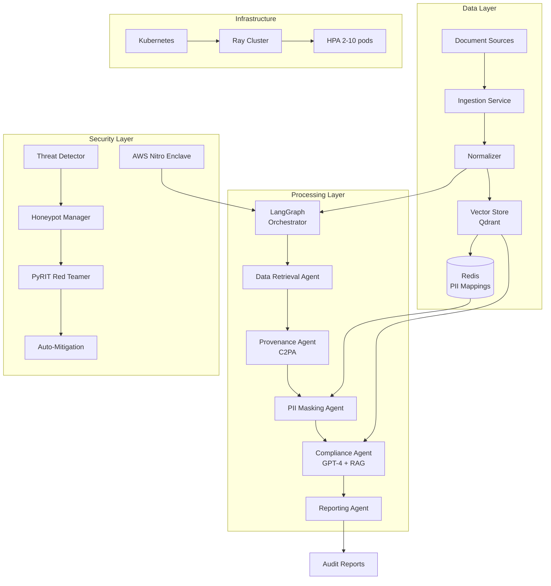
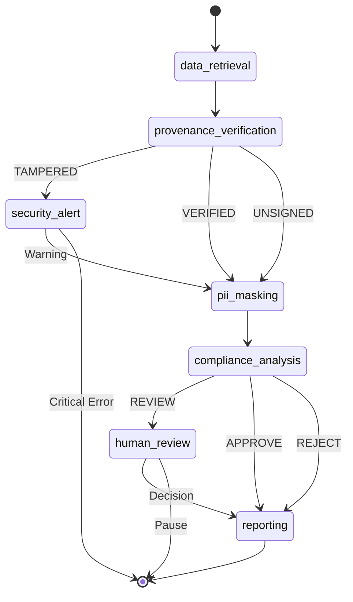

# Zero-Trust Multiagent ESG Audit System

> **Enterprise-Grade AI Engineering Portfolio Project (2026)**
> 
> A production-ready system for automated ESG (Environmental, Social, Governance) compliance auditing, integrating Gartner's top strategic technology trends: Multiagent Systems, AI-Native Platforms, Confidential Computing, Preemptive Cybersecurity, and Digital Provenance.

[](https://www.python.org/)
[](https://fastapi.tiangolo.com/)
[](https://github.com/langchain-ai/langgraph)
[](LICENSE)

---

## Table of Contents

- [Overview](#overview)
- [Architecture](#architecture)
- [Key Features](#key-features)
- [Quick Start](#quick-start)
- [API Reference](#api-reference)
- [Deployment](#deployment)
- [Configuration](#configuration)
- [Testing](#testing)
- [Project Structure](#project-structure)
- [Engineering Trade-offs](#engineering-trade-offs)
- [Contributing](#contributing)

---

## Overview

This system addresses the critical challenge of **ESG compliance automation** for multinational corporations navigating complex regulatory frameworks including:

- **EU Corporate Sustainability Reporting Directive (CSRD)**
- **SEC Climate Disclosure Rules**
- **Corporate Sustainability Due Diligence Directive (CSDDD)**
- **Carbon Border Adjustment Mechanism (CBAM)**

### Problem Statement

Modern enterprises face:
1. **Data Fragmentation**: Inconsistent supplier reporting formats across global supply chains
2. **Verification Challenges**: Difficulty validating authenticity of submitted documents
3. **Regulatory Complexity**: Overlapping but distinct compliance frameworks
4. **AI Security Risks**: Threats from prompt injection, data poisoning, and deepfakes

### Solution Architecture

This project implements a **zero-trust multiagent system** that:

1. **Ingests** ESG documents from multiple sources (S3, HTTP, Google Drive)
2. **Verifies** cryptographic provenance using C2PA standards
3. **Masks** PII algorithmically with Presidio
4. **Analyzes** compliance against CSRD/SEC frameworks using GPT-4
5. **Generates** audit-ready reports with evidence citations
6. **Protects** computation in AWS Nitro Enclaves (confidential computing)
7. **Defends** against adversarial attacks with preemptive cybersecurity

---

## Architecture

### High-Level System Design



### Multiagent Workflow (LangGraph DAG)



### Technology Stack

| Layer | Technology | Purpose |
|-------|------------|---------|
| **Orchestration** | LangGraph | DAG-based multiagent workflows with checkpointing |
| **Vector DB** | Qdrant | Hybrid search (dense + sparse) with metadata filtering |
| **Embeddings** | OpenAI text-embedding-3-small | 1536-dimensional semantic vectors |
| **LLM** | GPT-4-turbo-preview | Structured compliance analysis |
| **PII Masking** | Microsoft Presidio | Named Entity Recognition + replacement |
| **Provenance** | C2PA (c2pa-python) | Cryptographic content authenticity |
| **Confidential Computing** | AWS Nitro Enclaves | Hardware-isolated execution |
| **Security** | PyRIT + Honeypots | Preemptive threat detection |
| **Orchestration** | Kubernetes + Ray | Distributed scaling |

---

## Key Features

### 1. Multiagent Compliance Analysis

```python
from services.agents import create_audit_graph

graph = create_audit_graph()

result = await graph.run_audit(
    raw_content=document_text,
    metadata={
        "supplier_id": "SUPP-001",
        "region": "EU",
        "reporting_period": "2024"
    }
)

print(f"Compliance Score: {result.compliance_result.compliance_score}")
print(f"Decision: {result.compliance_result.overall_decision}")
```

### 2. Hybrid Vector Search (RAG)

```python
from services.vectorstore import get_rag_retriever

retriever = get_rag_retriever()

context = await retriever.retrieve_for_regulation(
    regulation_code="ESRS E1",
    supplier_id="SUPP-001",
    region="EU"
)

# Returns relevant chunks with compliance hints
```

### 3. LLM-Enhanced Analysis with Fallback

```python
from services.llm import get_llm_analyzer

analyzer = get_llm_analyzer()

findings = await analyzer.analyze_compliance(
    text=document_text,
    regulations=["ESRS E1", "SEC-GHG"],
    metadata={"region": "EU"}
)

# Falls back to rule-based analysis if LLM fails
```

### 4. C2PA Provenance Verification

```python
from services.verification import C2PAValidator

validator = C2PAValidator()
report = validator.validate_provenance(document_bytes)

if report.status == ValidationStatus.SYNTHETIC_AI:
    print("Warning: AI-generated content detected")
```

### 5. PII Algorithmic Masking

```python
from services.privacy import PIIMasker

masker = PIIMasker(redis_manager)

masked_text, success = masker.mask_text(
    "Report by Jane Doe at Berlin facility",
    document_id="doc-123"
)
# Output: "Report by <PERSON_1> at <LOCATION_1>"
```

### 6. Preemptive Cybersecurity

```python
from services.security import HoneypotManager, PyRITRedTeamer

# Deploy honeypots
honeypot_mgr = HoneypotManager()
honeypot_mgr.create_honeypot(HoneypotType.DATABASE)

# Run red team campaign
red_team = PyRITRedTeamer(auto_mitigate=True)
report = await red_team.run_attack_campaign(attacks_per_strategy=10)

print(f"Attack Success Rate: {report.attack_success_rate:.1%}")
```

---

## Quick Start

### Prerequisites

- Python 3.11+
- Docker & Docker Compose
- OpenAI API key

### 1. Clone & Configure

```bash
git clone https://github.com/your-org/esg-audit-system.git
cd esg-audit-system

# Create environment file
cat > .env << EOF
OPENAI_API_KEY=sk-your-key-here
PRIVACY_ENCRYPTION_KEY=$(python -c "from cryptography.fernet import Fernet; print(Fernet.generate_key().decode())")
ENCRYPTION_KEY=$(python -c "from cryptography.fernet import Fernet; print(Fernet.generate_key().decode())")
EOF
```

### 2. Start Services

```bash
# Start core services first (lower disk/memory footprint)
docker compose up -d redis qdrant document-fetcher privacy-service audit-agents vector-store

# Optional: UI + security service
docker compose up -d ui-service security-service

# Verify services are running
docker compose ps
```

### 3. Run Your First Audit

```bash
# Submit an audit request
curl -X POST http://localhost:8003/api/audit \
  -H "Content-Type: application/json" \
  -d '{
    "content": "Our company achieved net zero emissions in 2024. Scope 1 emissions: 5,000 tCO2e. Scope 2: 12,000 tCO2e. Scope 3: 45,000 tCO2e. We have committed to science-based targets and use 100% renewable energy.",
    "supplier_id": "SUPP-001",
    "region": "EU",
    "reporting_period": "2024"
  }'
```

### 4. Check Results

```bash
# Get audit status
curl http://localhost:8003/api/audit/{thread_id}

# Get full report
curl http://localhost:8003/api/audit/{thread_id}/report
```

---

## API Reference

### Core Endpoints

| Service | Port | Endpoint | Description |
|---------|------|----------|-------------|
| Audit Agents | 8003 | `POST /api/audit` | Submit document for audit |
| Audit Agents | 8003 | `GET /api/audit/{id}` | Get audit status |
| Vector Store | 8004 | `POST /api/index` | Index document chunks |
| Vector Store | 8004 | `POST /api/search` | Hybrid search |
| Privacy | 8002 | `POST /api/mask` | Mask PII in text |
| Security | 8006 | `POST /api/redteam/run` | Run red team campaign |
| Security | 8006 | `GET /api/threats/alerts` | Get threat alerts |

### OpenAPI Documentation

Access interactive API docs at:
- Audit Agents: http://localhost:8003/docs
- Vector Store: http://localhost:8004/docs
- Security: http://localhost:8006/docs

---

## Deployment

### Docker Compose (Development)

```bash
docker compose up -d
```

### Kubernetes (Production)

```bash
# Set environment variables
export DOCKER_REGISTRY=your-registry.io
export IMAGE_TAG=v1.0.0

# Deploy to Kubernetes
./deploy.sh

# Or use kustomize
kubectl apply -k k8s/
```

### AWS Nitro Enclave (Confidential Computing)

```bash
# Build the Enclave Image File (EIF)
./enclave/scripts/build_enclave.sh

# Deploy to EC2 with Nitro Enclaves enabled
./enclave/scripts/deploy_enclave.sh
```

---

## Configuration

### Environment Variables

| Variable | Required | Description |
|----------|----------|-------------|
| `OPENAI_API_KEY` | Yes | OpenAI API key for GPT-4 and embeddings |
| `ENCRYPTION_KEY` | Yes | Fernet key for PII mapping encryption |
| `LLM_MODEL` | No | LLM model (default: gpt-4-turbo-preview) |
| `USE_LLM_ANALYSIS` | No | Enable LLM-enhanced analysis (default: true) |
| `QDRANT_HOST` | No | Qdrant host (default: localhost) |
| `REDIS_HOST` | No | Redis host (default: localhost) |

### Regulatory Framework Configuration

Edit `k8s/base/configmaps.yaml` to customize compliance rules:

```yaml
data:
  csrd-rules.yaml: |
    regulations:
      - code: ESRS E1
        name: Climate Change
        requirements:
          - GHG emissions disclosure
          - Climate transition plan
```

---

## Testing

### Run All Tests

```bash
# Install test dependencies
pip install pytest pytest-asyncio pytest-cov

# Run tests with coverage
pytest --cov=services --cov-report=html

# Run specific test suites
pytest services/agents/tests/
pytest services/vectorstore/tests/
pytest services/security/tests/
```

### Integration Tests

```bash
# Mark integration tests
pytest -m integration --timeout=60
```

---

## Project Structure

```
esg-audit-system/
├── services/
│   ├── agents/           # LangGraph multiagent system
│   │   ├── nodes/        # Agent node implementations
│   │   ├── tools/        # Compliance checker tools
│   │   ├── state.py      # AuditState model
│   │   └── graph.py      # DAG workflow definition
│   ├── vectorstore/      # Qdrant + embeddings
│   │   ├── embeddings.py # OpenAI/local embeddings
│   │   ├── qdrant_client.py
│   │   ├── indexer.py    # Document chunking
│   │   └── retriever.py  # RAG retrieval
│   ├── llm/              # GPT-4 integration
│   │   ├── client.py     # OpenAI client
│   │   ├── prompts.py    # Prompt templates
│   │   └── analyzer.py   # Compliance analyzer
│   ├── privacy/          # PII masking
│   │   ├── presidio_masker.py
│   │   └── redis_manager.py
│   ├── verification/     # C2PA provenance
│   │   └── c2pa_validator.py
│   ├── security/         # Cybersecurity
│   │   ├── honeypot/     # Decoy systems
│   │   └── redteam/      # PyRIT attacks
│   └── ingestion/        # Document fetcher
├── enclave/              # AWS Nitro Enclave
│   ├── attestation/      # PCR verification
│   ├── communication/    # vsock protocol
│   └── crypto.py         # Enclave encryption
├── k8s/                  # Kubernetes manifests
│   ├── base/             # Namespace, RBAC, secrets
│   ├── services/         # Deployment manifests
│   └── ray/              # Ray cluster config
├── docker-compose.yml
├── deploy.sh
└── README.md
```

---

## Engineering Trade-offs

### Why LangGraph over CrewAI?

**Decision**: Selected LangGraph for deterministic, DAG-based state management.

| Factor | LangGraph | CrewAI |
|--------|-----------|--------|
| **Control Flow** | Explicit conditional edges | Task-driven delegation |
| **State Persistence** | Native checkpointing | Requires custom implementation |
| **Auditability** | Full state snapshots | Conversation history only |
| **Best For** | Regulated financial workflows | Standard business automation |

**Rationale**: ESG compliance auditing requires strict auditability and the ability to resume from checkpoints for human-in-the-loop workflows. LangGraph's deterministic routing prevents the conversational drift observed in autonomous frameworks.

### Why Qdrant over Pinecone?

**Decision**: Selected Qdrant for self-hosted control and hybrid search.

| Factor | Qdrant | Pinecone |
|--------|--------|----------|
| **Deployment** | Self-hosted or cloud | SaaS only |
| **Hybrid Search** | Native dense + sparse | Dense only |
| **Cost at Scale** | Predictable (infra) | Variable (usage) |
| **Data Residency** | Full control | Provider managed |

**Rationale**: MNCs handling sensitive supply chain data often require data residency guarantees. Qdrant's Rust-based architecture provides superior throughput for enterprise workloads.

### Why Structured Output over Free-Form?

**Decision**: Use GPT-4 function calling for type-safe Pydantic responses.

**Rationale**: Compliance findings must be programmatically processable. Structured output guarantees that confidence scores, severity levels, and remediation suggestions are consistently parsable, eliminating post-processing ambiguity.

---

## Contributing

1. Fork the repository
2. Create a feature branch (`git checkout -b feature/amazing-feature`)
3. Commit changes (`git commit -m 'feat: add amazing feature'`)
4. Push to branch (`git push origin feature/amazing-feature`)
5. Open a Pull Request

See [CONTRIBUTING.md](CONTRIBUTING.md) for detailed guidelines.

---

## License

This project is licensed under the MIT License - see [LICENSE](LICENSE) for details.

---

## Acknowledgments

- [LangGraph](https://github.com/langchain-ai/langgraph) - Multiagent orchestration
- [Qdrant](https://qdrant.tech/) - Vector database
- [C2PA](https://c2pa.org/) - Content provenance standards
- [Microsoft Presidio](https://github.com/microsoft/presidio) - PII anonymization
- [PyRIT](https://github.com/Azure/PyRIT) - AI red teaming framework
# esg-audit-system
